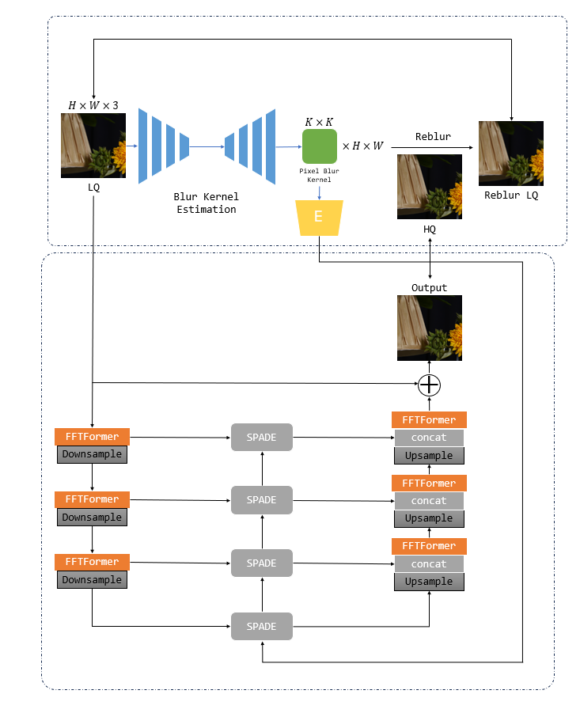

# NTIRE2024-RAIM-IIP_IR-Phase2

This is the code repository of Restore Any Image Model (RAIM) in the Wild: An NTIRE Challenge in Conjunction with CVPR 2024.

## Team: **IIP_IR**

## How to run?

### Installation

``` shell
git clone https://github.com/zzzhy03/NTIRE2024-RAIM-IIP_IR.git
cd NTIRE2024-RAIM-IIP_IR
pip3 install -r requirements.txt
```

### Pretrained Model

The pretrained model can be downloaded from [Google Drive](https://drive.google.com/drive/folders/1oHzTMuhQV831PPxkloox_D07nyqmyI-9?usp=drive_link), and put it under folder `pretrained`.


### Inference

#### phase2

``` shell
python demo_phase2.py --input_folder xxx --output_folder xxx --kernel_model_path pretrained/net_kernel.pth --restore_model_path pretrained/net_g.pth
```

## General method description of phase 2. 



We have introduced an integrated framework for image restoration. As shown in Fig 1, the framework comprises two main components. The first component is a Blur Kernel Estimation module(BKE), designed to estimate the blur kernel of LQ images. This U-Net shape module generates a $K\times K$ blur kernel for each pixel. Subsequently, these blur kernels are utilized to produce reblur LQ images based on the paired HQ images, thereby enabling supervised training for the U-Net model.

The second component is the restoration module. It is also designed using a U-Net architecture consisting of 3 layers. Each layer is connected by a SPADE block. The feature map before Downsample will be processed by the SPADE block, and then combined with the feature map after Upsample at the same layer. Additionally, the blur kernel estimated by BKE will also be embedded into the SPADE block at the middle of U-Net. 

